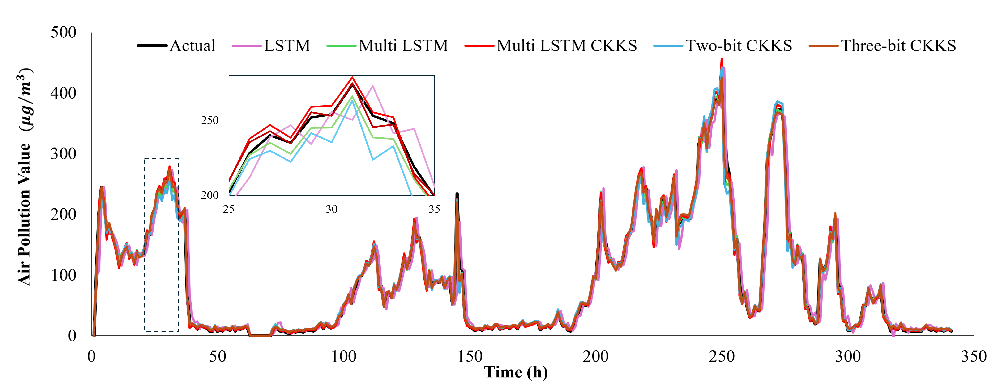

# Efficient AI with Homomorphic Encryption

Implementation of secure AI training using CKKS homomorphic encryption and matrix quantization for two real-world tasks: air pollution forecasting and forest fire detection.

**Paper**: Quoc Bao Phan and Tuy Tan Nguyen, "Efficient Artificial Intelligence with Novel Matrix Transformations and Homomorphic Encryption," IEEE Journal on Emerging and Selected Topics in Circuits and Systems, vol. 14, no. 4, pp. 717–728, Dec. 2024. 

## Quick Start

### Installation
```bash
pip install -r requirements.txt
```

### Run Experiments

Keep in mind that you MUST have dataset saved in the data folder.
- Air pollution: https://www.kaggle.com/datasets/rupakroy/lstm-datasets-multivariate-univariate

- Forest Fire: https://www.kaggle.com/datasets/elmadafri/the-wildfire-dataset

```bash
# Air pollution forecasting
python experiments/air_pollution.py

# Forest fire detection
python experiments/forest_fire.py
```

## Results

### Air Pollution Forecasting




### Forest Fire Detection


High accuracy (>98%) achieved across all models with CKKS encryption maintaining performance while ensuring data privacy.

## Key Features

- **CKKS Homomorphic Encryption**: Train on encrypted data
- **Matrix Quantization**: {-1, 0, 1} quantization reduces complexity
- **Maintains Accuracy**: R² > 0.90 for forecasting, >98% for classification

## Project Structure
```
efficient-ai-he/
├── src/
│   ├── ckks.py              # CKKS encryption
│   ├── quant_linear.py      # Matrix quantization
│   ├── models.py            # LSTM & ViT models
│   ├── utils.py             # Data loading & metrics
│   └── train.py             # Training pipeline
│
├── experiments/
│   ├── air_pollution.py     # Air pollution experiments
│   └── forest_fire.py       # Forest fire experiments
│
└── results/                 # Output metrics & plots
```

## Citation
```bibtex
@article{phan2024efficient,
  author       = {Quoc Bao Phan and Tuy Tan Nguyen},
  title        = {Efficient Artificial Intelligence with Novel Matrix Transformations and Homomorphic Encryption},
  journal      = {IEEE Journal on Emerging and Selected Topics in Circuits and Systems},
  volume       = {14},
  number       = {4},
  pages        = {717--728},
  year         = {2024},
  month        = dec,
  doi          = {10.1109/JETCAS.2024.3466849},
}
```

## License


MIT
